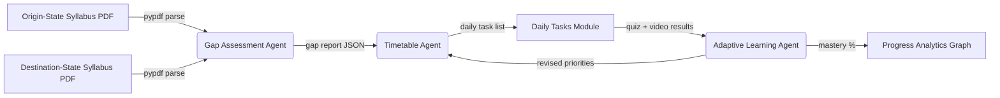

# 🎓 Vidyayan (विद्यायन)

> **A Learning-Continuity Workspace for Children of Migrant Families**
> Preserving educational progress, bridging state curriculum gaps, and supporting multi-lingual learning across state migrations in India — powered by a multi-agent AI engine.

<p align="center">
  
  
  
  
  
</p>

---

## 📌 Table of Contents

- [Overview & Mission](#-overview--mission)
- [Key Features](#-key-features)
  - [1. AI Agent Ecosystem](#1-ai-agent-ecosystem)
  - [2. Student Dashboard & Profile Management](#2-student-dashboard--profile-management)
  - [3. Daily Date-Based Tasks & Strict Watch Mode](#3-daily-date-based-tasks--strict-watch-mode)
  - [4. Learning Progress & Analytics Graph](#4-learning-progress--analytics-graph)
  - [5. Curriculum Bridge & Syllabus Finder](#5-curriculum-bridge--syllabus-finder)
  - [6. Multilingual Lesson Translation](#6-multilingual-lesson-translation)
  - [7. Secure User Authentication](#7-secure-user-authentication)
- [Project Architecture](#-project-architecture)
- [Tech Stack](#-tech-stack)
- [Getting Started](#-getting-started)
  - [Prerequisites](#prerequisites)
  - [1. Backend & Database Setup](#1-backend--database-setup)
  - [2. Frontend Setup](#2-frontend-setup)
- [API Endpoints](#-api-endpoints)
- [Roadmap](#-roadmap)
- [Contributing](#-contributing)
- [License](#-license)

---

## 🌟 Overview & Mission

When families migrate across state borders for work, children often face severe learning disruptions due to differences in state syllabi, medium of instruction, and academic calendars.

**Vidyayan** closes that gap with a persistent digital learning record and a trio of cooperating AI agents that do the work a parent or teacher would otherwise have to do by hand:

- **Tracks persistent academic progress** regardless of geographic relocations.
- **Automatically maps learning gaps** between origin and destination state curriculums using an AI-driven Gap Assessment Agent.
- **Generates a realistic daily study plan** with an AI Timetable Agent.
- **Adapts in real time** to how a child is actually performing, via an Adaptive Learning Agent.
- **Translates lessons** into the child's native language.
- **Enforces interactive daily learning tasks** with strict verification mechanisms.

---

## 🔥 Key Features

### 1. AI Agent Ecosystem

At the core of Vidyayan is a lightweight multi-agent system, written in Python, that turns two syllabus PDFs and a stream of quiz results into a living, self-correcting study plan.

| Agent | What it does | Runs when | Produces |
|---|---|---|---|
| 🔍 **Gap Assessment Agent** | Parses the origin-state and destination-state syllabus PDFs (via `pypdf`) and compares them chapter-by-chapter to find overlapping, missing, and reordered topics | A student profile is created, or a migration/state change is recorded | A structured gap report — "bridged," "pending," and "new" chapters per subject |
| 🗓️ **Timetable Agent** | Turns the gap report into a realistic, time-boxed daily plan, weighing subject priority, school hours, and the child's current mastery level | Right after the Gap Assessment Agent runs, or whenever the plan drifts out of date | The day-wise task list shown in the Daily Tasks accordion |
| 📈 **Adaptive Learning Agent** | Watches quiz scores and video-completion events, recalculates the mastery gauge, and re-weights the plan toward weak topics | After every quiz submission or completed video | An updated mastery score and revised task priorities, fed back to the Timetable Agent |



> **Suggested build:** each agent as its own module under `backend/agents/`, coordinated by a small `agentOrchestrator.py` that passes JSON between them. The Gap Assessment Agent can score chapter similarity with `sentence-transformers` (or a TF-IDF fallback), the Timetable Agent can use a constraint/heuristic scheduler, and the Adaptive Learning Agent can update mastery with a Bayesian-Knowledge-Tracing-style formula — optionally calling an LLM (OpenAI/Anthropic API) to turn the raw gap report into a plain-language explanation for parents. Swap in whichever specific models or libraries best fit your stack.

### 2. Student Dashboard & Profile Management
- **Interactive Student Cards**: View registered children with class level, photo avatar, and quick access to study routines.
- **Add / Edit Student Modal**: Add new student profiles or update existing ones with form validation and photo uploads.
- **Demo Data Generator**: Single-click `"Generate Demo Student"` button to populate test profiles instantaneously during testing.
- **Delete Student Record**: Low-profile icon-only delete action (`<Trash2 />`) with confirmation prompts to remove obsolete records.

### 3. Daily Date-Based Tasks & Strict Watch Mode
- **Date-Grouped Accordion**: Tasks organized chronologically (*Today*, *Yesterday*, *Tomorrow*) with collapsible task cards.
- **Interactive YouTube Embeds**: Embedded video lessons tied directly to specific syllabus chapters.
- **Strict Video Verification**: Enforces full video view duration before unlocking the completion button (`"Watching Video... 34s remaining"`). Children cannot skip or instantly mark videos as completed without watching.
- **Interactive Micro-Quizzes**: Multiple-choice questions for knowledge verification with instant feedback and animated tick bars — results are the raw signal the Adaptive Learning Agent consumes.

### 4. Learning Progress & Analytics Graph
- **Liquid Wave Mastery Gauge**: Animated circular gauge displaying overall mastery percentage (68%) with undulating liquid waves and floating bubbles.
- **Warm Light Hero Banner**: Soft orange banner (`#fff5ee` → `#ffebd9`) highlighting active learning streaks, bridged gaps, and total study hours.
- **High-Contrast Mastery Graph**:
  - High-precision SVG curve graph styled in crisp dark slate black (`#0f172a`).
  - Animated line path drawing (`@keyframes drawGraphLine`), translucent area fill, pulsing node rings, and popover tooltips.
  - Interactive Y-axis percentage scale (`0%` - `100%`) and growth badge (`+32% Growth`).
  - **Subject Filter Tabs**: Filter weekly performance dynamically across *Overall*, *Mathematics*, *Science*, *English*, and *Social Science*.
- **Persistent Learning Record**: Dedicated panel documenting completed chapters, bridged gaps, pending gaps, and live synchronization status.

### 5. Curriculum Bridge & Syllabus Finder
- **State Transition Gap Analyzer**: Maps subject-wise chapter overlaps and differences when moving between states (e.g., Maharashtra → Karnataka) — the data layer the Gap Assessment Agent runs on.
- **PDF Syllabus Extractor**: Server-side Python engine utilizing `pypdf` to parse and analyze uploaded state syllabus documents.

### 6. Multilingual Lesson Translation
- **Express Translation Proxy**: Backend proxy interfacing with LibreTranslate to enable real-time lesson translations.
- **Supported Languages**: Hindi, Kannada, Marathi, Tamil, Telugu, Gujarati, Bengali, and English.

### 7. Secure User Authentication
- **Registration Form**: Collects full family migration context (phone, password, native language, origin state, destination state, migration month & year).
- **Security**: Passwords hashed using `bcrypt`. Stateful API calls authenticated via JSON Web Tokens (JWT).
- **Route Guarding**: All app views are protected behind authentication middleware.

---

## 📁 Project Architecture

```
vidyayan/
├── frontend/                 # React 18 + Vite Web Application
│   ├── src/
│   │   ├── AddStudent.jsx    # Add / Edit Student component with Demo Generator
│   │   ├── DailyTasks.jsx    # Date-based daily task accordion & strict video mode
│   │   ├── Progress.jsx      # Progress analytics & black curve SVG line graph
│   │   ├── StudentDashboard.jsx # Main Dashboard view with student cards
│   │   ├── CurriculumBridge.jsx # State-to-state syllabus mapping
│   │   ├── TranslateLesson.jsx  # Multilingual lesson translator
│   │   ├── Login.jsx & Register.jsx # Authentication pages
│   │   ├── studentsStore.js  # Persistent student store (localStorage synced)
│   │   ├── progress.css      # Progress page & SVG graph animations
│   │   └── daily-tasks.css   # Daily task accordion & timer styles
│   ├── index.html
│   └── vite.config.js
│
├── backend/                  # Node.js + Express API Server
│   ├── routes/
│   │   ├── authRoutes.js     # User registration and JWT login routes
│   │   ├── translateRoutes.js# LibreTranslate API proxy route
│   │   ├── syllabusRoutes.js # Python PDF syllabus extractor launcher
│   │   └── agentRoutes.js    # NEW — routes into the AI agent layer
│   ├── agents/                    # NEW — Python AI agent layer
│   │   ├── gapAssessmentAgent.py  # Compares two syllabi, finds the gap
│   │   ├── timetableAgent.py      # Builds a realistic daily study plan
│   │   ├── adaptiveLearningAgent.py # Monitors test results, adjusts plan
│   │   └── agentOrchestrator.py   # Passes structured data between agents
│   ├── extract_pdf.py        # Python script using pypdf for PDF parsing
│   ├── server.js             # Express app entry point & database initializer
│   └── requirements.txt      # Python dependencies
│
└── database/                 # SQLite Database Layer
    ├── schema.sql            # Table definitions (users, students, progress)
    └── vidyayan.db           # Auto-generated SQLite database instance
```

---

## 🛠️ Tech Stack

- **Frontend**: React 18, Vite, Lucide React, Custom CSS (Variables, Glassmorphism, Animations)
- **Backend**: Node.js, Express.js, JSON Web Tokens (JWT), Bcrypt
- **Database**: SQLite3
- **AI / Agent Layer (Python)**:
  - Orchestration: `backend/agents/agentOrchestrator.py`
  - **Gap Assessment Agent**: `pypdf` for extraction + `sentence-transformers` (or a TF-IDF fallback) for chapter-similarity scoring
  - **Timetable Agent**: heuristic / constraint-based scheduling (e.g. `python-constraint`)
  - **Adaptive Learning Agent**: mastery updates using a Bayesian-Knowledge-Tracing-style formula
  - Optional: OpenAI / Anthropic API for natural-language gap explanations and parent-facing summaries
- **PDF Processing**: Python 3, `pypdf`
- **Icons & Typography**: Lucide Icons, Google Fonts (*Fraunces*, *Outfit*, *Inter*)

---

## 🚀 Getting Started

### Prerequisites

Ensure you have the following installed on your system:
- **Node.js**: v18.0.0 or higher
- **npm**: v9.0.0 or higher
- **Python**: v3.9 or higher (with `pip`)

---

### 1. Backend & Database Setup

1. Navigate to the `backend` directory:
   ```bash
   cd backend
   ```

2. Install Node.js dependencies:
   ```bash
   npm install
   ```

3. Install Python dependencies for PDF parsing and the AI agent layer:
   ```bash
   python -m pip install -r requirements.txt
   ```
   `requirements.txt` should include, at minimum:
   ```
   pypdf
   sentence-transformers
   scikit-learn
   python-constraint
   python-dotenv
   # optional, only if you wire in LLM-generated explanations
   openai
   anthropic
   ```

4. Create the environment configuration:
   ```bash
   cp .env.example .env
   ```
   *(Adjust `PYTHON_EXECUTABLE`, `JWT_SECRET`, `PORT`, and any AI API keys as needed)*

5. Start the backend dev server:
   ```bash
   npm run dev
   ```
   The backend API will run at **`http://localhost:4000`**. The SQLite database (`database/vidyayan.db`) will be automatically created on first boot.

---

### 2. Frontend Setup

1. Open a new terminal tab and navigate to the `frontend` directory:
   ```bash
   cd frontend
   ```

2. Install dependencies:
   ```bash
   npm install
   ```

3. Start the Vite development server:
   ```bash
   npm run dev
   ```

4. Open your browser and navigate to **`http://localhost:5173`**.

---

## 📡 API Endpoints

### Authentication
- `POST /api/auth/register` - Create a new user account with migration details.
- `POST /api/auth/login` - Authenticate user credentials and return JWT token.

### Translation & Syllabus
- `POST /api/translate` - Proxy lesson text translation requests to LibreTranslate.
- `POST /api/syllabus/extract` - Extract structured text from uploaded syllabus PDF files.

### AI Agents
- `POST /api/agents/gap-assessment` - Compare origin/destination syllabi and return a structured gap report.
- `POST /api/agents/timetable` - Turn a gap report into a day-wise study plan.
- `POST /api/agents/adaptive-learning` - Submit quiz/video results and receive an updated mastery score plus revised task priorities.

---

## 🧭 Roadmap
- [ ] Offline-first PWA mode for low-connectivity areas
- [ ] Parent/guardian companion view with weekly progress summaries
- [ ] LLM-powered doubt-clearing chat tied to the current lesson
- [ ] Expand curriculum coverage beyond the initial state pairs

---

## 🤝 Contributing
Issues and pull requests are welcome. Please open an issue describing the proposed change before submitting a large PR.

---

## 📄 License

Distributed under the **MIT License**. See `LICENSE` for more information.
